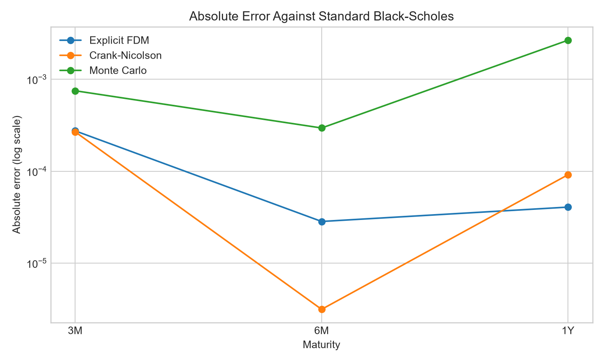

# Critical Replication of Finite-Difference Option Pricing

An independent computational replication and audit of An Ning (2023),
[*A Mean Convection Finite Difference Method for Solving Black Scholes Model
for Option Pricing*](https://arxiv.org/abs/2308.06808).

## Research question

Can finite-difference and Monte Carlo methods reproduce European option prices
under the paper's stated Black-Scholes parameters, and are the paper's reported
accuracy claims reproducible from the methodological information provided?

## Methods implemented

- Analytical Black-Scholes benchmark
- Explicit finite-difference method
- Crank-Nicolson finite-difference method
- Monte Carlo with antithetic variates and a fixed seed
- Paper-inspired convection-scaling sensitivity experiment

## Main replication findings

- Standard Black-Scholes closely reproduces several reported exact values, but
  the six-month call values in Tables 1 and 2 are inconsistent with the stated
  parameters.
- Tables 3 and 4 are labelled as puts, yet their exact values closely resemble
  call prices under the spot and strike values stated in the narrative.
- Independent explicit FDM and Crank-Nicolson implementations closely match the
  analytical benchmark on the paper's 100-by-1,000 grid.
- The published MCFDM cannot be uniquely reconstructed because essential flux
  definitions, the construction of `alpha(S)`, boundary/grid choices, code, and
  random seeds are not fully specified.

For the paper's three-month Table 1 scenario, the independent benchmark is:

| Method | Price | Absolute error vs analytical |
| --- | ---: | ---: |
| Analytical Black-Scholes | 0.099025 | 0.000000 |
| Explicit FDM | 0.099300 | 0.000274 |
| Crank-Nicolson | 0.099293 | 0.000267 |
| Monte Carlo (100,000 paths, seed 42) | 0.099774 | 0.000749 |



These observations are documented transparently in
[`docs/PAPER_AUDIT.md`](docs/PAPER_AUDIT.md). The repository does not force its
calculations to match reported values and does not claim an exact MCFDM
reproduction.

## Repository structure

```text
notebooks/
  00_research_design.ipynb
  01_black_scholes_benchmark.ipynb
  02_finite_difference_methods.ipynb
  03_replication_results.ipynb
src/
  option_pricing.py
  replication.py
tests/
  test_option_pricing.py
results/
  figures/
docs/
  MATH_GUIDE.md
  PAPER_AUDIT.md
```

## Run locally

From Anaconda Prompt:

```bash
conda activate paper_env
python -m pip install -r requirements.txt
python run_replication.py
python -m pytest -q
```

Open the notebooks in numerical order and select the `paper_env` kernel.

## Reproducibility choices

- Paper grid where stated: 100 asset-price intervals and 1,000 time steps.
- Upper boundary: four times the larger of spot and strike (documented because
  the paper does not specify it).
- Monte Carlo: 100,000 paths, antithetic variates, and explicit seeds.
- All independent errors are measured against the standard analytical
  Black-Scholes formula, not against an inconsistent reported value.

## Skills demonstrated

- Translating a pricing PDE into explicit and Crank-Nicolson grid algorithms
- Applying linear algebra through a tridiagonal system solve
- Applying probability through risk-neutral Monte Carlo simulation
- Measuring numerical error, uncertainty, stability, and runtime
- Testing put-call parity, method accuracy, and financial monotonicity
- Auditing a quantitative paper without concealing irreproducible details

## Scope

This is an educational numerical-analysis project, not financial advice. The
focus is method validation, reproducibility, error measurement, and critical
reading of quantitative research.

## Reference

Ning, A. (2023). *A Mean Convection Finite Difference Method for Solving Black
Scholes Model for Option Pricing*. arXiv:2308.06808.
